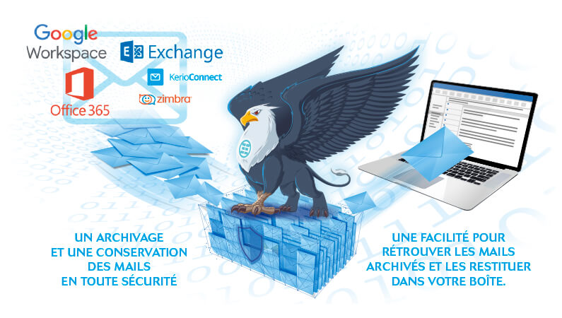

Que vous souhaitez organiser vos emails, alléger la charge de votre serveur de messagerie ou aller au delà de votre quota disponible, l’archivage automatique des emails devient une solution précieuse.

> *Notre solution **KEENTON Archiv’Mail** propulsée par **MailStore** archive automatiquement vos emails dans une zone disponible et sécurisée. Votre boite mail se retrouve allégée et son utilisation gagne en clarté.\*

Mettez fin à l’archivage de vos emails en local (PST) pouvant mettre en péril vos données en cas de défaillance matériel, l’archivage de vos emails n’aura jamais été aussi simple et intelligent qu’avec KEENTON Archiv’Mail.

## LA réponse à vos problèmes de gestion des mails

> *Compatible avec la plupart des messageries, **Office 365**, **Google Workspace**, **Microsoft Exchange**, **Kerio Connect**, **Zimbra** ainsi que tous les serveurs compatible IMAP et POP3.*

## KEENTON Mail’Archiv en 6 points clés

### Réduction des quotas

Une fois archivés, les e-mails peuvent être supprimés des boites de messagerie du serveur ce qui permet de maintenir constamment la charge du serveur à un faible niveau

### Centralisation des archivages

Elimination des fichiers PST disséminés sur les postes grâce à la zone d’archivage centralisée, sécurisée et toujours accessible

### Accès rapide

Une zone d’archivage permettant des recherches rapides que ça soit sur le contenu et les pièces jointes

### RGPD

Keenton Archiv’mail définit des politiques de conservation des données élaborées afin de respecter les normes RGPD.

### Hébergement

Un archivage en datacentre sur le sol français avec les plus hauts niveaux de sécurité Tier 4, ISO 27001 et norme médicale HDS ​

### Infogérance totale

Notre équipe veille à l’archivage de vos emails et prend en charge toutes les problématiques la concernant

> *Ne vous souciez plus des quotas de messagerie, simplifiez-vous la vie en centralisant de façon sécurisée tous vos mails disséminés sur votre poste de travail grâce à notre solution KEENTON Archiv’Mail.*

Visitez notre page sur nos offres de solution de messagerie, Office 365, Microsoft Exchange et Kerio Connect mais aussi sur notre redoutable solution Anti-Spam maison.

**Consultez notre page produit « Messagerie » en cliquant ici**
