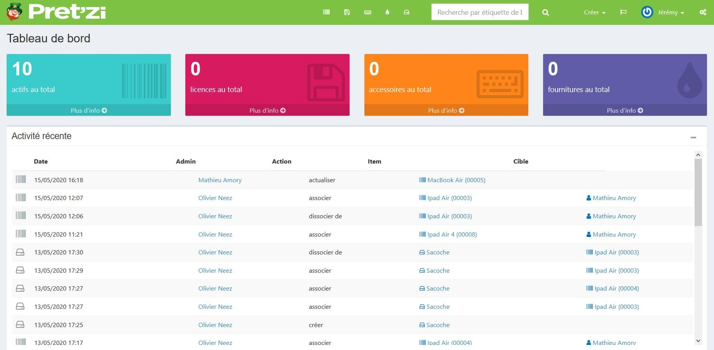
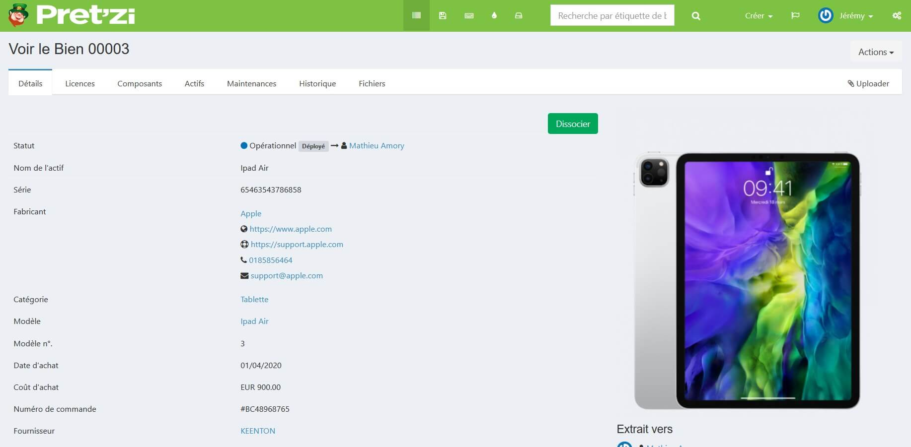

La gestion des prêt dans le milieu éducatif est un casse-tête permanent. Bien souvent les établissements ne disposent pas de logiciels efficaces et simples d’utilisation pour gérer le prêt des matériels pédagogiques.

> *Dans bien des cas, ils utilisent des logiciels obsolètes inadaptés aux besoins. Dans d’autres cas le système D s’applique, tableau Excel crée pour l’usage ou cahier pour émarger les prêts.*

La prolifération des outils pédagogiques informatique a rendu le problème encore plus présent. Keenton, société de service informatique impliquée dans le milieu éducatif, c’est vu interrogée par plusieurs établissements souhaitant pouvoir disposer d’une solution moderne et simple d’utilisation.

Ne trouvant pas sur le marché des solutions adéquates répondant aux besoins des écoles, nous avons décidé de mettre au point et de proposer notre propre solution : **Prêt’ZI**

## Une interface didactique, intuitive et simple d’utilisation

Prêt’ZI va vous permettre de saisir les dispositifs et de suivre votre parc de matériel disponible aux prêt. Vous pourrez d’un coup d’œil, prendre connaissance des prêts en retard mais aussi la durée de vie d’un matériel pour anticiper son renouvellement.

Vos utilisateurs, en plus de connaitre à tout moment ce qui est disponible, pourront en toute autonomie réserver un dispositif et connaitre le statut des prêts fait jusqu’ici.

Des notifications par email permettent de valider les prêts mais aussi pour les deux parties de se tenir informé des retards.

## Scanner de code barre

Chaque dispositif sera saisie avec son code barre rendant les phrases de prêt et de retour beaucoup plus simple et fluide.

## D’autres cas d’usages

Pourquoi se limiter au matériel informatique ? Prêt’ZI est souvent utilisé pour les prêts de livre au CDI, matériel sportif pour les professeurs d’éducation physique…

## KEENTON

C’est en écoutant nos clients que nous avons pu élaborer une solution proche de leurs attentes tout en étant en constante évolution.

Prêt’ZI est hébergé en France, dédié pour chacun de nos clients et <u>hébergé en France</u>. Une solution Cloud, aucun matériel nécessaire sur place et aucune maintenance à prévoir.

Afin d’étudier au mieux votre projet, nos équipes sont à votre disposition. Veuillez SVP remplir le formulaire ci-dessous, afin qu’un commercial vous contacte pour étudier vos besoins.
