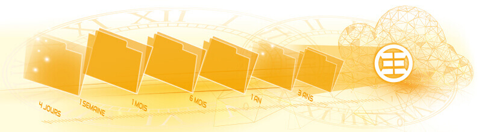
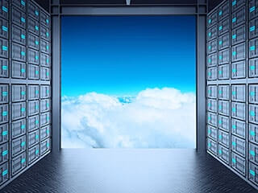

La sauvegarde des données est une pratique importante qui permet de protéger ses fichiers et informations en cas de perte, de dommages ou de suppression accidentels.

La sauvegarde 3-2-1 est un concept garantissant en cas de bonne pratique que vous disposerez de sauvegardes fiables face à ces différents scénarios :

- Panne matérielle
- Erreur humaine
- Virus informatique
- Incendie ou inondation

## Rappelons le concept de la sauvegarde 3-2-1

### Copies de vos données

Vos données de production et deux sauvegardes. La sauvegarde locale permet une restauration rapide, l’externalisée pour les catastrophes majeures.

### Supports différents

La politique de sauvegarde doit s’appuyer sur deux supports différents. Nous recommandons une sauvegarde locale hors production et une externalisée.

### Sauvegarde hors site

Si un sinistre se produit dans vos locaux (incendie, vol, catastrophe naturelle, …), vos données seront toujours en sécurité hors site.

> ***La sauvegarde 3-2-1 : votre plan de secours pour que vos fichiers disent « Je reviendrai ! » 🙂***

## Mais surtout n’oubliez pas

### Un raid n’est pas une sauvegarde !

> ***Pourquoi ? Un raid ou une réplication dupliquent les données, si un utilisateur fait une erreur, si un ransomware chiffre vos données, tout sera dupliqué en l’état (<a href="/blog/ransomwares-limportance-des-couches-de-securite-en-entreprise" target="_blank" rel="noopener">Notre article sur les Ransomwares</a>). Nous ne pourrons pas revenir sur d’anciennes versions à un instant T.***

Ce que nous allons rechercher avec une sauvegarde, c’est la rétention ! Cette possibilité de remonter le temps sur un certain nombre de jours. **In-dis-pen-sable** pour faire face aux erreurs humaines ou aux virus dormants comme les ransomwares.

### L’externalisation manuelle sur un disque externe

Les sauvegardes manuelles dépendent entièrement de l’action humaine, ce qui les rend sujettes aux oublis et aux erreurs.

Cette tâche est souvent exécutée par une personne en charge d’une autre activité dans l’entreprise, sans compétences avancées en informatique.

> ***Quand un incident se produit, il n’est pas rare que la dernière sauvegarde soit lointaine, que le disque soit introuvable ou dysfonctionne.***

## KEENTON et la sauvegarde

Chez KEENTON, nous proposons des services vous permettant de prendre en charge votre scénario de sauvegarde partiellement ou en totalité.

> ***Proposer une sauvegarde, une technologie est une chose, mais en prendre la responsabilité est le plus important.***

Nous sommes conscients qu’un tel concept n’est pas toujours réaliste face aux différents budgets et activités des entreprises.

Une étude préalable permettra de proposer le meilleur scénario de sauvegarde en phase avec le budget de l’entreprise dans l’objectif de diminuer au maximum les risques.

### Prise en charge totale du scénario de sauvegarde

### Externalisation hors site en Datacenter

### Prise en charge d'un site d'archivage (Compatible S3)

##   Nos clients en parlent mieux que nous

L’externalisation de nos sauvegardes est essentielle pour la sécurisation de notre activité. L’équipe KEENTON assure une protection efficace de nos données, nous permettant de nous concentrer sur notre activité principale.

Guillaume Fermigier, Directeur Informatique

Diadem

Confier un périmètre de son informatique n’est pas toujours simple. Avec KEENTON nous disposons d’une solution de sauvegarde cloud totalement pilotée par une équipe réactive et compétente.

Jean-François Communier, Directeur de production

Printvallée

Notre solution de sauvegarde cloud prend aussi en charge les postes de travail, les serveurs et les plateformes de virtualisation. Tous les types de fichiers, l’état système ou encore de nombreuses bases de données.

**Consultez notre page produit « Sauvegarde Cloud » en cliquant ici**
