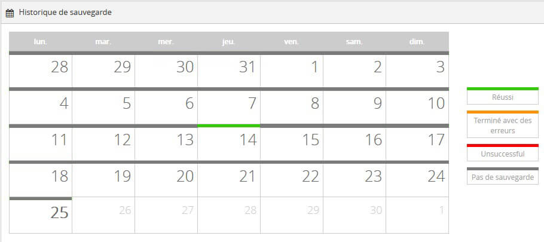

Dans ce billet nous allons présenter comment sauvegarder et restaurer un poste ou un serveur sous Windows. Une sauvegarde sécurisée de bout en bout, avec rétention, permettant l’archivage et même le plan le reprise d’activité pour les serveurs.

## Installation de l’agent / Une installation rapide

Tout commence par le déploiement de l’agent qui demandera rapidement une clé de chiffrement. Cette clé de chiffrement garantira que vous seul serez habilité à accéder aux données. Cette clé est très importante sans elle vous perdez l’accès aux données sauvegardées !

## Que sauvegarde t’on ?

Pour une sauvegarde standard, nous choisirons tous les fichiers du système ainsi que l’état du système. Avec ces paramètres nous serons capable de réaliser tout type de restauration, partielle ou totale (Bare Metal). Il est temps de lancer la sauvegarde !

## Bilan des sauvegardes

Tout a l’aire de s’être bien passé, vérifions ! Le jour d’aujourd’hui (le 14) est au vert, nous pouvons cliquer dessus pour avoir des précisions, super c’est ok !

## Restauration partielle

Le jour J arrive, le moment de solitude, le dérapage, le clique de trop qui supprime le fruit de deux semaines de travail sans savoir comment… Une restauration va nous permettre de tout récupérer.

## Conclusion

Simple ? Oui ! Mais en faite chez KEENTON vous ne gérez rien, l’installation, le suivi, la gestion, on s’occupe de tout ! Nous infogérons totalement les sauvegardes afin de garantir qu’à tout moment une restauration soit possible et nous guidons nos clients à chaque restauration. Si vous souhaitez plus d’informations sur notre solution de sauvegarde externalisée rendez-vous sur la page [Sauvegarde Cloud](https://www.keenton.com/sauvegarde-cloud/).

## Restauration Bare Metal

Qu’est-ce qu’une restauration Bare Metal ? C’est tout simplement une restauration totale, le système et les fichiers. Le Bare Metal permet une restauration depuis une clé USB permettant ainsi une restauration totale lorsque le système d’exploitation n’est plus accessible. Vous souhaitez en savoir plus ? C’est ici : [Sauvegarde Cloud : Restauration Windows en Bare Metal](/blog/sauvegarde-cloud-restauration-windows-en-bare-metal)
