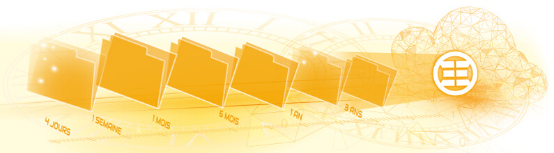

Centraliser les données sur un NAS Synology est un schéma classique au sein des entreprises. Disposer d’une sauvegarde fiable hors site devient vite indispensable pour répondre à tous les scénarios de restauration.

> *Avoir une sauvegarde est un bon point, pouvoir restaurer au moment crucial quelle que soit la situation est le plus important. KEENTON s’engage à vous accompagner lors des restaurations de vos données.*

Une solution de sauvegarde cloud taillée pour les stockages Synology permettant de restaurer à tout instant ! Historique de restauration (rétention) allant de 28 jours jusqu’à l’archivage de 1 an à 3 ans !*\*

## Les 6 points clés de notre sauvegarde cloud Synology

### Hébergement

Une sauvegarde en datacentre sur le sol français avec les plus hauts niveaux de sécurité Tier 4, ISO 27001 et norme médicale HDS​

### Chiffrement

Chiffrement de bout en bout, vos données ne peuvent être lisibles dans nos datacentres sans la clé de chiffrement

### Réplication

Les données sauvegardées sont répliquées automatiquement vers un deuxième datacentre totalement indépendant

### La règle 1,2,3

Respect de la règle du 1,2,3 ! Possibilité d’un point de sauvegarde en local et/ou d’un point de sauvegarde supplémentaire dans un 3ème datacentre

### Synology

Intégration native aux solutions Synology. Aucun matériel supplémentaire !

### Infogérance totale

Notre équipe gère l’ensemble de vos sauvegardes vous détachant entièrement de cette tâche

> *Nous savons que confier la gestion de ses sauvegardes n’est pas chose aisée, c’est pourquoi nous avons conçu une offre flexible reposant sur des fondations solides aussi bien techniquement qu’humainement.*

##   Nos clients en parlent mieux que nous

Nos données sont au centre de nos préoccupations. L’objectif, trouver une offre de sauvegarde externalisée nous permettant d’avoir l’esprit tranquille. KEENTON répond parfaitement à nos besoins et nous apporte un service de qualité depuis de nombreuses années.​

Lionel Dupuydenus, Chef de studio

Epiceum

Chez Fluide Glacial, sauvegarder nos données de production n’était pas une option. L’Offre KEENTON fut une évidence pour nous, un service complet prenant absolument tout en charge du suivi jusqu’à la restauration !​

Clément Argouarc'h, Directeur de collection

Fluide Glacial

Notre solution de sauvegarde cloud prend aussi en charge les postes de travail, les serveurs et les plateformes de virtualisation. Tous les types de fichiers, l’état système ou encore de nombreuses bases de données.

**Consultez notre page produit « Sauvegarde Cloud » en cliquant ici**
