Il est toujours important de garder un œil sur sa solution antispam, nous allons dans ce guide expliquer comment superviser la solution Sonicwall Email Security avec Zabbix.

## Configuration SNMP du Sonicwall

La configuration du SNMP se trouve dans le menu `Système > Avancé` :

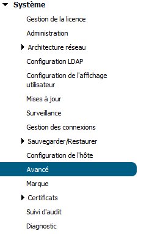

on active le SNMP et on rentre la communauté :

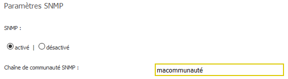

## Configuration Zabbix

Le template Zabbix à importer se trouve sur nos dépôts publiques: [Template Sonicwall Email Security](https://code.keenton.com/Zabbix/template-sonicwall-email-security).

Une fois l’hôte créé sur le serveur Zabbix il suffit de le lier au template sans oublier de lui attribuer une macro pour la communauté SNMP.

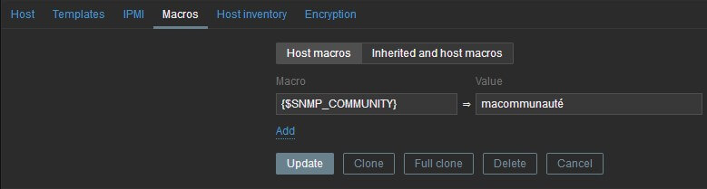

## Les Graphiques

Les graphiques ci-dessous sont issues d’un tableau de bord Grafana mais leurs équivalents Zabbix sont bien compris dans le template.

[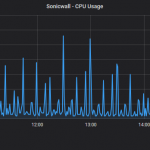](/images/blog/ancien-blog/sonicwall-email-security-zabbix-graphique-cpu.png)
CPU

<!-- -->

[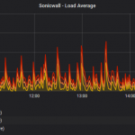](/images/blog/ancien-blog/sonicwall-email-security-zabbix-graphique-load-average.png)
Load Average

<!-- -->

[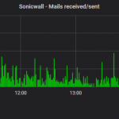](/images/blog/ancien-blog/sonicwall-email-security-zabbix-graphique-received-send.png)
Received / Send

<!-- -->

[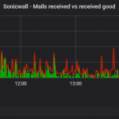](/images/blog/ancien-blog/sonicwall-email-security-zabbix-graphique-mail-received-vs-good.png)
Received vs Good

[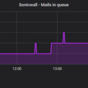](/images/blog/ancien-blog/sonicwall-email-security-zabbix-graphique-mail-queue.png)
Queue

<!-- -->

[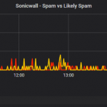](/images/blog/ancien-blog/sonicwall-email-security-zabbix-graphique-spam.png)
Spam vs Likely Spam

<!-- -->

[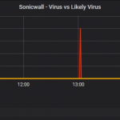](/images/blog/ancien-blog/sonicwall-email-security-zabbix-graphique-virus.png)
Virus

<!-- -->

[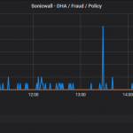](/images/blog/ancien-blog/sonicwall-email-security-zabbix-graphique-dha-fraud-policy.png)
DHA / Fraud / Policy

## Les Triggers

- Usage CPU trop haut (Warning à 80% / High à 90%)
- Load Average trop haut (Warning à 5)
- Mail Queue trop longue (Warning à 50, on reviens à la normale en dessous de 10)
- L’Antispam à redémarré

## Conclusion

Nous serons maintenant alerté en cas de problème majeur sur l‘antispam, nous avons fait le choix de ne pas créer de triggers sur certaines métriques (spam, virus, etc…) pour ne pas être envahie d’événements Zabbix, mais il est toujours possible d’étoffer le template si le besoin s’en fait ressentir.
